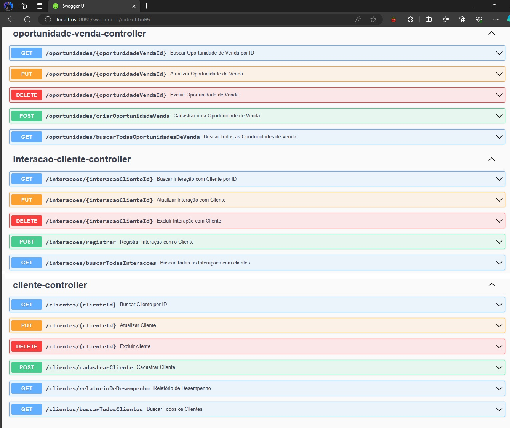
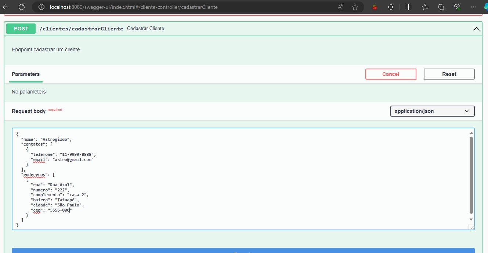
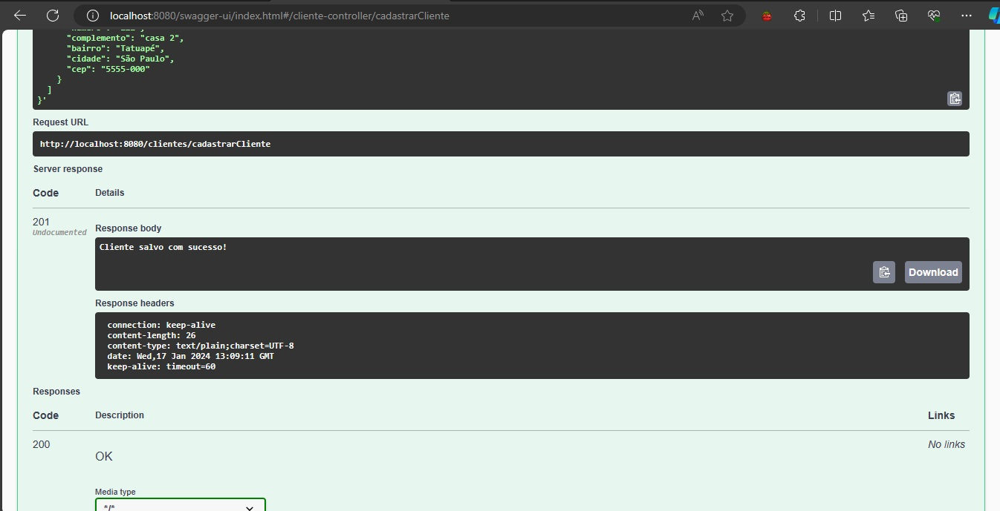
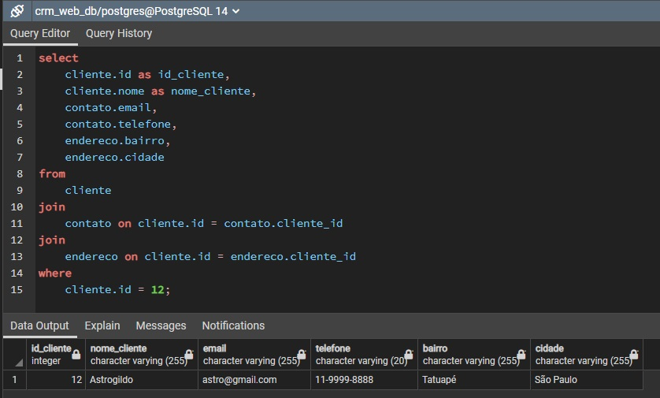
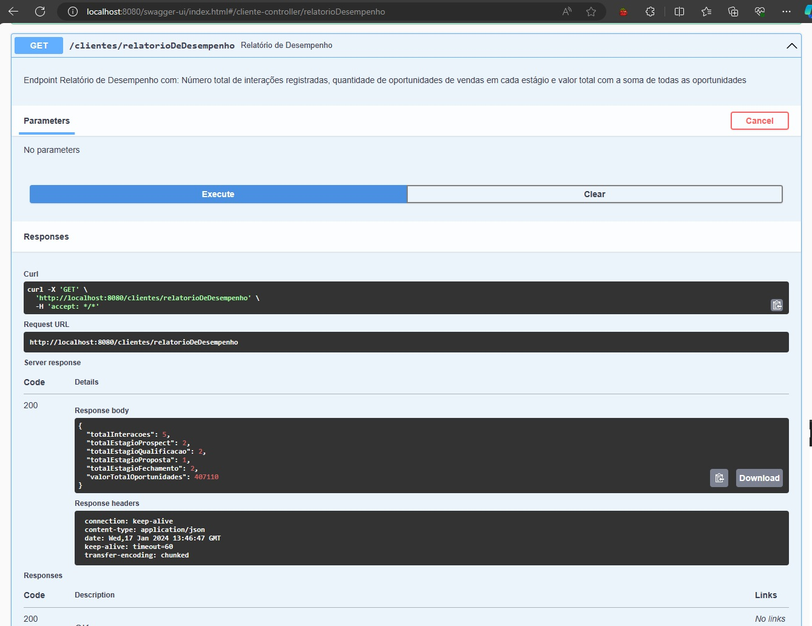

# Requisitos:

## Cadastro de clientes:
Os usuários devem poder adicionar, visualizar, atualizar e excluir informações dos clientes através de uma interface de usuário ou API RESTful. As informações a serem coletadas são: nome completo, endereço, número de telefone, endereço de e-mail e outras informações relevantes. Cada cliente deve ser identificado por um número de cliente exclusivo.

## Registro de Interações:
Os usuários devem poder registrar interações com os clientes, como chamadas telefônicas, reuniões ou e-mails. Cada interação deve conter uma descrição, data e hora.

## Gerenciamento de Oportunidades de Vendas:
Os usuários devem ser capazes de criar oportunidades de vendas para clientes. Cada oportunidade de venda deve conter informações como nome do cliente, estágio da oportunidade (prospect, qualificação, proposta, fechamento etc.) e valor estimado da venda. As oportunidades devem ser vinculadas aos clientes correspondentes.

## Relatórios de Desempenho:
O sistema deve fornecer relatórios de desempenho, como o número total de interações registradas, oportunidades de vendas em cada estágio, valores totais das oportunidades etc.

## APIs RESTful:
Implementar APIs RESTful para todas as operações CRUD (Create, Read, Update, Delete) relacionadas a clientes, interações e oportunidades. Utilize os verbos HTTP apropriados para cada operação (POST, GET, PUT, DELETE). Utilize os status code apropriados para o retorno de cada uma das respostas. Construa um tratamento de erro centralizado para sua API.

## Documentação:
Criar documentação clara e concisa que explique as APIs disponíveis e formas de interagir com elas. Use ferramentas como o Swagger para gerar a documentação da API automaticamente. Utilize as annotations do Java para melhorar a descrição da documentação.

## Interface (extra):
Construir uma interface de usuário simples, usando HTML, CSS e JavaScript, para interagir com as APIs RESTful. A interface deve permitir aos usuários executar todas as operações do sistema.

Swagger UI

Cadastrar Cliente

Banco de Dados

Relatório de Desempenho

